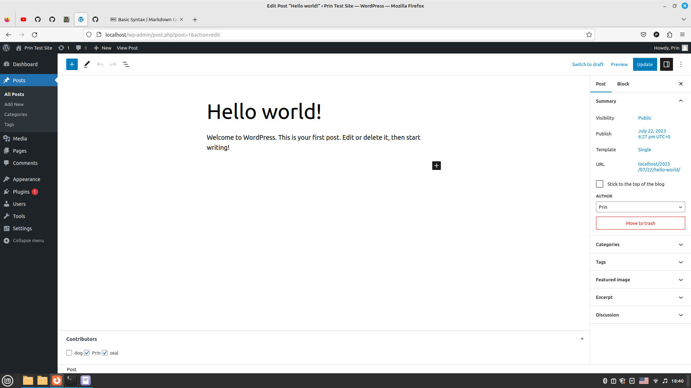
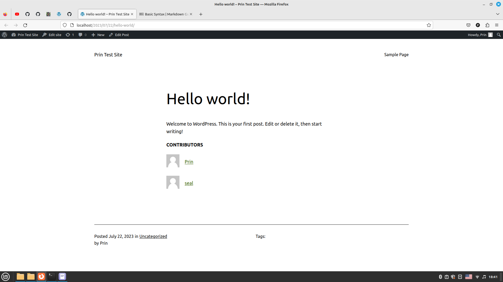

# Test plugin to learn WP plugin dev

Author: Prin S
Version: 1.0
Tested on: 6.2.2

## Description

The plugin was created to help me learn WordPress plugin development. It displays a meta box below each post allowing you to add contributors (must be author, editor or administrator) to that post which. These contributors are then shown on the front-end.

## Installation

1. Upload test-plugin-to-learn-wp-plugin-dev.zip to the /wp-content/plugins/ directory
2. Activate the plugin through the 'Plugins' menu in WordPress

## Screenshots

## Changelog

### 1.0
This is the first version.